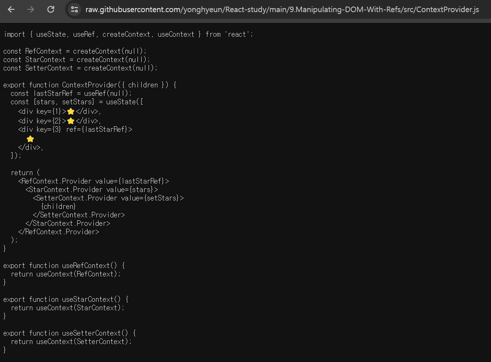

# Date : [2024-03-24]

`octokit` 라이브러리를 이용해서 깃허브 API 를 이용해보았다.

```js
import { Octokit } from 'octokit';

const ACCESS_TOKEN = 'ghp_x3U5...';
const octokit = new Octokit({
  auth: ACCESS_TOKEN,
});

export const fetchIssue = async ({ owner, repo }) => {
  const res = await octokit.request('GET /repos/{owner}/{repo}/issues', {
    owner,
    repo,
  });

  const body = await res.data;

  return body;
};
```

`Octokit` 으로 `Auth` 프로퍼티가 설정된 객체를 생성해주고

해당 객체의 `request` 메소드를 이용해 요청이 가능하다.

위 예시는 깃허브 API 페이지에서 제공하는 예제 코드이다. 어떤 오너의 레파지토리명으로 GET 요청을 보내는

도착해서 오는 `res.data` 를 살펴보면 여러 데이터들뿐 아니라

또 다양한 API 의 엔드포인트들을 담은 정보를 배열 형태에 담아 주는 모습을 볼 수 있다.

> 다른 엔드포인트는 어떨지 모르겠다. 우선 이슈를 가져오는 엔드포인트는 그렇다.

```json
[
  {
    "url": "https://api.github.com/repos/yonghyeun/BlogProject/issues/4",
    "repository_url": "https://api.github.com/repos/yonghyeun/BlogProject",
    "labels_url": "https://api.github.com/repos/yonghyeun/BlogProject/issues/4/labels{/name}",
    "comments_url": "https://api.github.com/repos/yonghyeun/BlogProject/issues/4/comments",
    "events_url": "https://api.github.com/repos/yonghyeun/BlogProject/issues/4/events",
    "html_url": "https://github.com/yonghyeun/BlogProject/issues/4",
    "id": 2203714986,
    "node_id": "I_kwDOLc2NIM6DWgWq",
    "number": 4,
    "title": "[Feature] 00 . API 명세서 살펴보고 구현 가능 기능 살펴보기  ",
    "user": {
      "login": "yonghyeun",
      "id": 123540354,
      "node_id": "U_kgDOB10Tgg",
      "avatar_url": "https://avatars.githubusercontent.com/u/123540354?v=4",
      "gravatar_id": "",
      "url": "https://api.github.com/users/yonghyeun",
      "html_url": "https://github.com/yonghyeun",
      "followers_url": "https://api.github.com/users/yonghyeun/followers",
      "following_url": "https://api.github.com/users/yonghyeun/following{/other_user}",
      "gists_url": "https://api.github.com/users/yonghyeun/gists{/gist_id}",
      "starred_url": "https://api.github.com/users/yonghyeun/starred{/owner}{/repo}",
      "subscriptions_url": "https://api.github.com/users/yonghyeun/subscriptions",
      "organizations_url": "https://api.github.com/users/yonghyeun/orgs",
      "repos_url": "https://api.github.com/users/yonghyeun/repos",
      "events_url": "https://api.github.com/users/yonghyeun/events{/privacy}",
      "received_events_url": "https://api.github.com/users/yonghyeun/received_events",
      "type": "User",
      "site_admin": false
    },
    "labels": [
      {
        "id": 6658517462,
        "node_id": "LA_kwDOLc2NIM8AAAABjODp1g",
        "url": "https://api.github.com/repos/yonghyeun/BlogProject/labels/todo",
        "name": "todo",
        "color": "D75465",
        "default": false,
        "description": "일자별 todo list"
      },
      {
        "id": 6658548669,
        "node_id": "LA_kwDOLc2NIM8AAAABjOFjvQ",
        "url": "https://api.github.com/repos/yonghyeun/BlogProject/labels/in-progress",
        "name": "in-progress",
        "color": "73BF1B",
        "default": false,
        "description": ""
      }
    ],
    "state": "open",
    "locked": false,
    "assignee": null,
    "assignees": [],
    "milestone": null,
    "comments": 0,
    "created_at": "2024-03-23T05:57:00Z",
    "updated_at": "2024-03-23T05:57:00Z",
    "closed_at": null,
    "author_association": "OWNER",
    "active_lock_reason": null,
    "body": "## (2024-03-24)\r\n## Todos \r\n[] 1. 깃허브 API 사용법 살펴보기 \r\n[] 2. 깃허브 API 명세서 살펴보고 구현 가능 기능 살펴보기\r\n\r\n## Reference\r\n\r\n## [Post link (Optional)]\r\n",
    "reactions": {
      "url": "https://api.github.com/repos/yonghyeun/BlogProject/issues/4/reactions",
      "total_count": 0,
      "+1": 0,
      "-1": 0,
      "laugh": 0,
      "hooray": 0,
      "confused": 0,
      "heart": 0,
      "rocket": 0,
      "eyes": 0
    },
    "timeline_url": "https://api.github.com/repos/yonghyeun/BlogProject/issues/4/timeline",
    "performed_via_github_app": null,
    "state_reason": null
  }
]
```

신경쓰이는 부분은 리퀘스트 헤더를 보낼 때 `Authorization` 부분에 나의 `gh Access token` 이 그대로 보내지는 것이다.

다만 API 의 엔드포인트가 `https` 프로토콜을 사용하고 있으니 이래도 괜찮은건가 싶기도 하다.

> 그런데 깃허브 API 에서 만료기간이 60분인 비밀키를 또 제공한다고 하기도 하니까 나중에 이걸 사용해봐야겠다. ><

어지저찌 `octokit` 도 사용해봤으니 내게 필요한 엔드포인트들을 제공하는지를 확인해보자

---

# 사용할 엔드포인트 기능들 살펴보기

### Repository list [V]

Ref : https://docs.github.com/ko/rest/repos/repos?apiVersion=2022-11-28#list-public-repositories

endpoint : /user/repos (_다만 인증된 상태로_), /users/{username}/repos

쿼리 매개변수 `sort , direction , type , afflication , visibility`

> - 파일 디렉토리가 tree 라는 프로퍼티로 나타난다.

### Commit list [V]

1. 커밋 리스트를 가져오는 엔드포인트  
   endpoint : /repos/{owner}/{repo}/commits/

2. Compare two commits
   endpoint : /repos/{owner}/{repo}/compare/{basehead}
   > 씁 이건 잘 모르겠다 아직 깃허브의 포크 레파지토리라고 하는데

### 레파지토리 통계에 대한 엔드포인트 []

1. Get the weekly commit activity
   endpoint : /repos/{owner}/{repo}/stats/code_frequency
   > Returns a weekly aggregate of the number of additions and deletions pushed to a repository.

커밋 리스트에 대한 통계는 아니고 몇 번이나 포크가 일어났고 브랜치로 push 가 일어났는지에 대한 정보인거 같음

### Get repository content []

1. `path` 별 파일의 콘텐츠 가져오기

endpoint : /repos/{owner}/{repo}/contents/{path}

지렸다 해당 부분에 들어간 후 download url 링크를 이용함녀 해당 영역의 코드를 가져오는 것이 가능하다.



`path` 부분은 `/` 부분으로부터 상대경로로 작성해 가져오는 것이 가능하다.

2. 리드미 가져오는 엔드포인트

endpoint : /repos/{owner}/{repo}/readme

> 레파지토리의 리드미가 아닌 디렉토리의 readme 를 가져오는 엔드포인트는
> /repos/{owner}/{repo}/readme/{dir} 이다.

### Event List []
